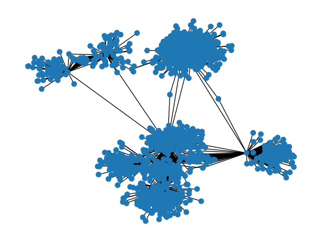

## Домашнее задание 2: описание файлов

## `wikipedia_crawler.py` и `draw_wiki.py`
Простой кроулер, принимает на вход название статьи в Википедии,
затем ходит по ссылкам в статьях вплоть до указанной глубины. Я
добавила ещё искусственное ограничение на количество посещённых 
уникальных страниц. Не думаю, что в одиночку уроню Википедию, но 
всё равно создавать лишнюю нагрузку без необходимости как-то 
нехорошо.

Граф контактов в виде списка рёбер пишется в файл `<название_статьи>.json`, 
потом отрисовывается скриптом `draw_wiki.py`. Картинка по умолчанию 
сохраняется в файл `output.png`. Например, если на вход
подать статью "Sprite" при `depth=5` получаем такое:

Даже по картинке видно, что глубины 5 тут программа не достигла, на самом
деле она "упёрлась" в моё ограничение в 1000 страниц. Но даже так, в целом,
видно, что есть будто бы несколько кластеров, что можно объяснить, например,
многозначностью слова Sprite. Навскидку в голову приходят, как минимум, 
напиток и спрайты в играх.

## <s>Кроулер для Amazon при помощи Selenium

Я так и не поняла, как это можно заставить работать. Как я поняла, проблема 
состоит в том, что наиболее новый (и единственный доступный для скачивания без какого-то совсем 
шаманизма) Chrome для Ubuntu имеет версию `146.0.7680.164-1`, в то время как
ChromeDriver, который бы был совместим с этой версией, я не нашла, как бы не искала.
Либо я идиотка тупая, либо просто не существует этой версии. В итоге после попыток
это починить в течение, наверное, часа, я убедилась в собственной никчёмности и решила забить.</s>

## `get_domains.py`
Так как данных экспериментов CHIP-seq на encodeproject в разы больше, 
чем DNAse-seq, я решила сначала найти те клеточные линии, для которых
есть эксперименты DNAse-seq, отсортировала по убыванию количества
экспериментов, и начала искать для них по очереди эксперименты CHIP-seq.
